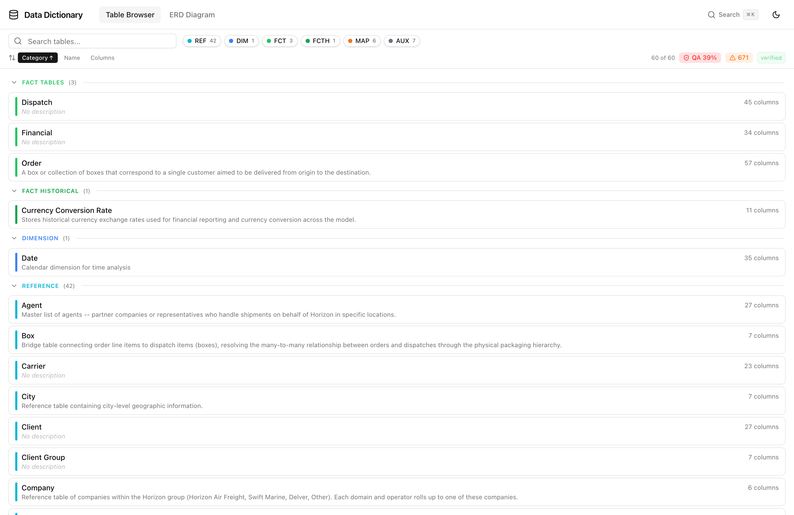
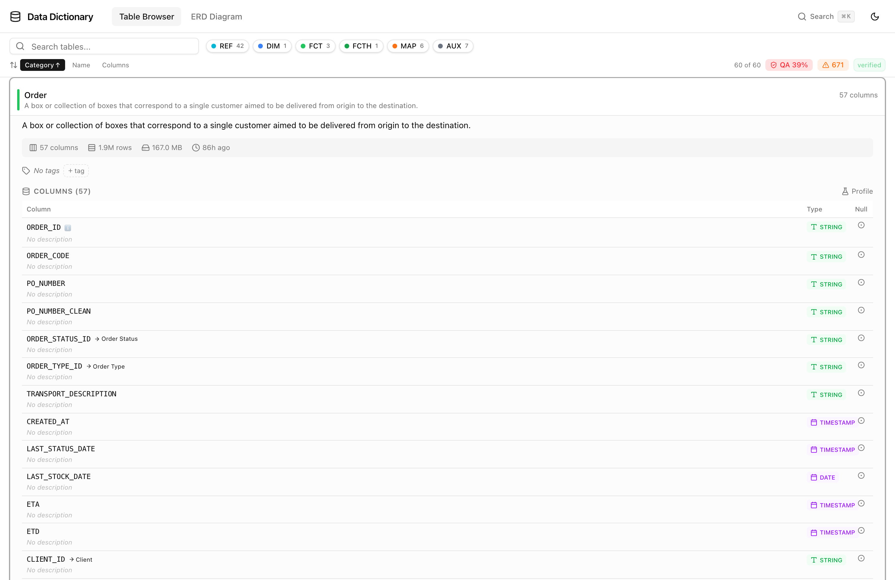
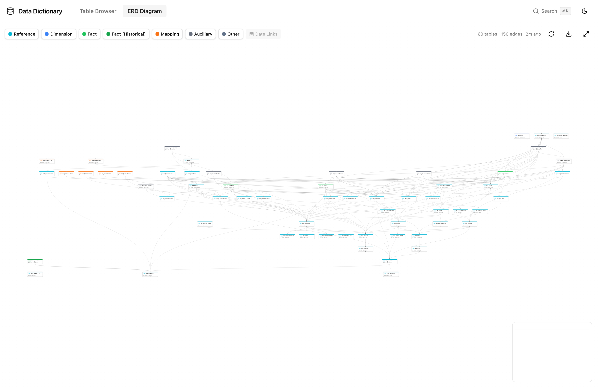
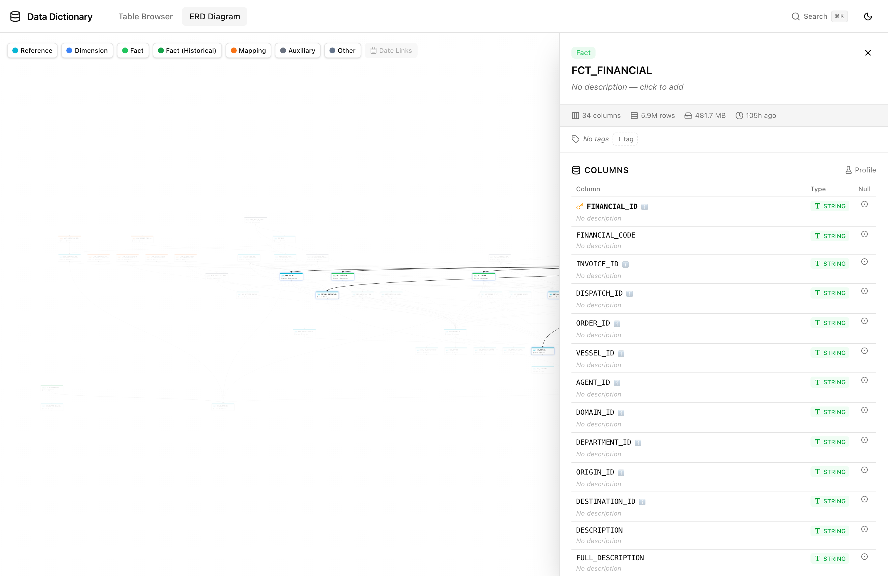
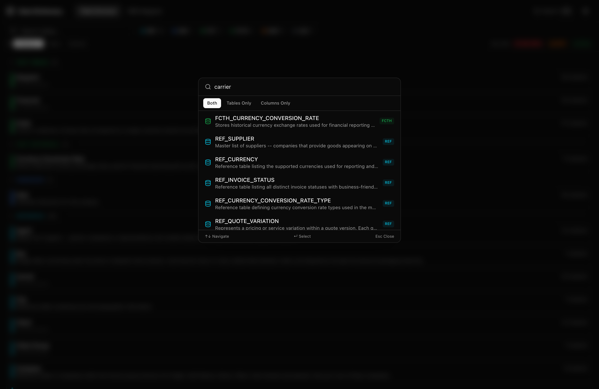
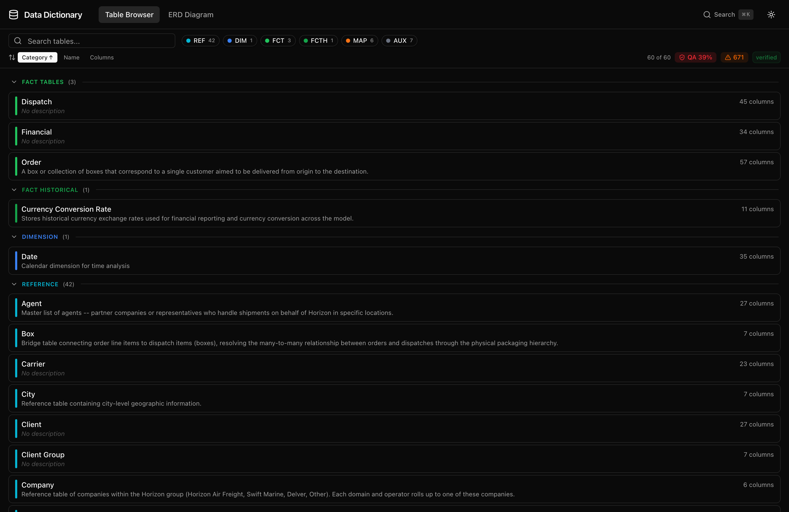

# BDM Data Dictionary & ERD Viewer

Interactive data dictionary, ERD visualization, and quality dashboard for the Business Data Model (BDM), built as a [Keboola Data App](https://help.keboola.com/components/data-apps/).



## Features

### Table Browser & Data Quality

Browse all 60 BDM tables organized by category with search, filtering, and sort. Category-colored cards show human-friendly names, descriptions, and column counts. Collapsible group headers keep large table sets manageable.

- **QA Stats** — Inline badges show QA score and issue count. Hover for full project stats (tables, columns, rows, data size, description coverage).
- **Category Filters** — Toggle categories (REF, DIM, FCT, FCTH, MAP, AUX) with short-code chips showing table counts.
- **Collaborative Tags** — Predefined tags (verified, needs-review, deprecated, core, wip, sensitive) plus custom free-form tags. Stored in Keboola metadata, filterable in the toolbar.

Click any table to expand its detail inline — columns with types, FK links, descriptions, tags, and data preview:



### ERD Visualization

Interactive Entity Relationship Diagram with all tables and inferred FK relationships. Tables are color-coded by category and auto-laid out using Dagre.



- **Floating Detail Panel** — Click a table node to open the detail sidebar. The ERD canvas stays fully interactive (pan, zoom, click) while the panel is open.
- **Connection Highlighting** — Click a node to dim unconnected tables and glow connected ones.
- **Date Link Visualization** — Toggle to show assumed DIM_DATE connections from DATE/TIMESTAMP columns.
- **Multi-Format Export** — Download as PNG (3x resolution), SVG (vector), or Mermaid `.mmd` file.



### Data Profiling

On-demand column profiling via a hybrid engine: Keboola native profiling API (exact stats over all rows) combined with data-preview API (1000-row sample for value-level analysis).

- **$NOVALUE Detection** — Color-coded `$NV: X%` badges on `_ID` columns. Green <5%, yellow 5-20%, red >=20%.
- **Expandable Column Stats** — Null rate bar, distinct count, min/max (type-aware), top 5 values. Footer shows whether stats are exact or approximate.
- **Profiling Cache** — Server-side 30-minute TTL with request deduplication.

### Search & Navigation

Global search (Cmd+K) with fuzzy matching across all tables and columns. Filter by Tables Only or Columns Only. Select a result to navigate directly to that table.



### Inline Editing

Click-to-edit table and column descriptions with confirmation dialog. Changes propagate to Keboola Storage API and update the in-memory cache optimistically.

### Dark Mode

System preference default with manual toggle. Persists via localStorage.



### Additional Features

- **Dynamic FK Inference** — No static manifest needed. Relationships discovered at runtime from `_ID` columns. New tables auto-discovered on refresh.
- **Auto-Refresh** — Metadata refreshed every 15 minutes. Manual refresh via toolbar button.
- **Mock Data Mode** — Auto-detected when Keboola credentials are missing. Serves sample tables for local development.

## Keboola Data App Configuration

### Required Environment Variables

Automatically injected by Keboola when deploying as a Data App.

| Variable | Required | Description |
|----------|----------|-------------|
| `KBC_TOKEN` | **Yes** | Keboola Storage API token. Needs read access to target bucket(s), write access for inline description editing. |
| `KBC_URL` | **Yes** | Keboola connection URL (e.g., `https://connection.eu-central-1.keboola.com`). |

### Optional Environment Variables

| Variable | Default | Description |
|----------|---------|-------------|
| `BUCKET_ID` | `out.c-bdm` | Primary bucket. The app also fetches from `{BUCKET_ID}_aux` automatically. |
| `PORT` | `3000` | Express server port. |

### Keboola Deployment Files

| File | Purpose |
|------|---------|
| `keboola-config/setup.sh` | Build script — runs `npm install && npm run build` |
| `keboola-config/nginx/sites/default.conf` | Nginx reverse proxy — listens on 8888, proxies to 3000 |
| `keboola-config/supervisord/services/app.conf` | Process manager — starts and auto-restarts Express |

## Local Development

### Prerequisites

- Node.js 18+
- npm

### Quick Start (No Credentials Needed)

```bash
git clone <repo-url>
cd bdm-data-dictionary
npm install
npm run dev
# -> http://localhost:5173 (mock data mode — 10 sample tables)
```

When `KBC_TOKEN` and `KBC_URL` are not set, the app serves mock data. All features work including description editing (changes persist in-memory until server restart).

### With Keboola Credentials

```bash
cp .env.example .env
# Edit .env with your credentials:
#   KBC_TOKEN=your-storage-api-token
#   KBC_URL=https://connection.eu-central-1.keboola.com
#   BUCKET_ID=out.c-bdm

npm run dev
# -> http://localhost:5173 (live Keboola data)
```

### Production Build

```bash
npm run build    # TypeScript check + Vite production build
npm start        # Express serves built SPA + API on :3000
```

## Data Model

The app visualizes tables from the BDM, organized by category:

| Category | Prefix | Color | Description |
|----------|--------|-------|-------------|
| Reference | `REF_` | Cyan | Reference/master data (e.g., REF_CLIENT, REF_CARRIER) |
| Dimension | `DIM_` | Blue | Conformed dimensions (e.g., DIM_DATE) |
| Fact | `FCT_` | Green | Transactional fact tables (e.g., FCT_ORDER, FCT_DISPATCH) |
| Fact (Historical) | `FCTH_` | Dark Green | SCD2-style historical facts |
| Mapping | `MAP_` | Orange | Event/bridge mapping tables |
| Auxiliary | `AUX_` | Gray | Junction/bridge tables |
| Other | -- | Slate | Tables with unrecognized prefixes |

## FK Inference Engine

Relationships are discovered automatically at runtime:

1. For each column ending in `_ID`, extract the entity name
2. Check the **skip list** (e.g., `EXTERNAL_SYSTEM_ID`)
3. Check **alias overrides** (e.g., `USER_ID` maps to `REF_OPERATOR`)
4. Skip self-referencing own-PK columns
5. **Direct entity match**: `CLIENT_ID` -> `REF_CLIENT` or `DIM_CLIENT`
6. **Progressive prefix strip**: `ORIGIN_LOCATION_ID` -> strip `ORIGIN_` -> `REF_LOCATION`
7. Validate: target table must exist and contain the expected PK column

### Customizing Overrides

Edit `server/overrides.json`:

```json
{
  "alias": { "COLUMN_NAME": { "target": "TARGET_TABLE", "targetColumn": "TARGET_PK" } },
  "skip": ["COLUMN_TO_IGNORE"],
  "add": [],
  "remove": []
}
```

## Tech Stack

| Layer | Technology |
|-------|------------|
| Frontend | React 18, TypeScript, Tailwind CSS 4 |
| ERD Rendering | @xyflow/react (React Flow) v12.4 + Dagre (auto-layout) |
| Command Palette | cmdk |
| Image Export | html-to-image |
| Icons | lucide-react |
| UI Primitives | shadcn/ui-style components (custom, CSS-variable based) |
| Backend | Node.js, Express.js |
| API | Keboola Storage API v2 (JSON format) |
| Build | Vite 6 |
| Deployment | Keboola JS Data App (nginx + supervisord) |
